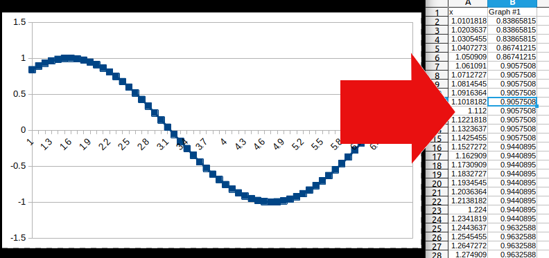

# graph_to_data

Convert image of graph to data:  

There is an online tool available, powered by egui:  
[Graph2Data Web](https://voelklmichael.github.io/graph_to_data/)  
This demo runs also on the desktop, Android to come next!

How to use it:

https://github.com/voelklmichael/graph_to_data/blob/main/use_case.mp4
